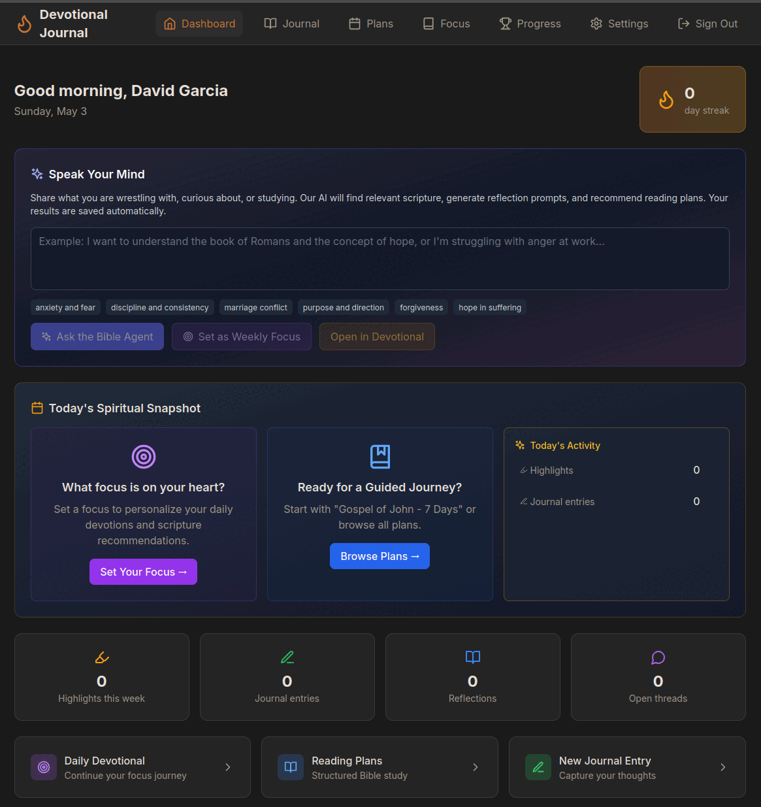

# Devotional Journal

> **A bilingual Bible study companion built for men who want to be consistent in their faith — not just on Sunday.**

Set a spiritual focus, follow AI-curated reading plans, and journal privately with end-to-end encryption. Built to be self-hosted, AGPL-licensed, and bring-your-own-AI from day one.

[](LICENSE)
[](.github/workflows/ci.yml)
[](#tech-stack)
[](#bilingual-from-the-ground-up)
[](#quick-start)



---

## Table of Contents

- [Why this app exists](#why-this-app-exists)
- [Who it's for](#who-its-for)
- [Features](#features)
- [Privacy & encryption](#privacy--encryption)
- [Bilingual from the ground up](#bilingual-from-the-ground-up)
- [Tech stack](#tech-stack)
- [Quick start](#quick-start)
- [Bring your own AI](#bring-your-own-ai)
- [Project structure](#project-structure)
- [Documentation](#documentation)
- [Roadmap](#roadmap)
- [FAQ](#faq)
- [Contributing](#contributing)
- [License](#license)

---

## Why this app exists

> *"I want to be consistent in my faith, but I keep falling off."*

That's the problem this app solves. Most Bible apps are either content libraries or social feeds — they don't help you build a daily rhythm.

Devotional Journal gives you a **focused habit loop**:

1. **Set a focus** — what you're working through (anxiety, leadership, anger, prayer life)
2. **Read** — daily passages curated to that focus
3. **Journal** — private, encrypted, with mood tagging
4. **Reflect** — life-area scoring + AI-detected follow-up threads
5. **Track** — streaks, milestones, and growth over time

The AI doesn't preach at you. It remembers what you've been wrestling with and asks the next right question.

---

## Who it's for

- **Men building daily Bible discipline** — fathers, leaders, men in recovery, men trying to grow up in their faith
- **Bilingual believers** — English and Spanish are first-class, including code-switching support
- **Privacy-conscious users** — your journal is encrypted at rest with a per-user key; even the database admin can't read it
- **Self-hosters and homelabbers** — runs on a Raspberry Pi or any Docker host with optional local-only AI via Ollama
- **Small accountability groups** — group features are on the roadmap (backend models already in place)

If you've been let down by Bible apps that felt like social media or paywalled study guides, this is built for you.

---

## Features

### Daily rhythm
- **AI-Curated Devotionals** — set a focus and get personalized scripture, reflection prompts, and study guides
- **Reading Plans** — browse pre-built plans (Gospel of John, Covenant Faithfulness, Proverbs) or generate your own with AI
- **Daily Pulse** — one-tap access to today's verse and prompt from the dashboard
- **Quick Capture** — a floating button to capture a thought from anywhere in the app
- **Streak Saver** — gentle nudge after 6pm if your streak is at risk

### Reflection & growth
- **Encrypted Journal** — private mood-tagged entries, AI deep-dive study guides on demand
- **Daily Reflections** — life-area scoring (faith, health, relationships, work, growth), gratitude, end-of-day check-ins
- **Open Threads** — AI detects recurring themes and follows up: *"Last week you mentioned anxiety about work. How's that going?"*
- **Milestones & Streaks** — confetti celebrations, share cards for 3/7/30/90/365-day milestones
- **Growth Visualization** — life-area trends, mood distribution, and a 30/60/90-day growth report

### Reading & study
- **Built-in Bible Reader** — KJV included; ASV, YLT, WEB, RVR1960 (Spanish), and more via the Bolls API
- **Highlights & Notes** — color-coded, with personal notes; exportable as Markdown
- **Search** — full-text scripture search across translations

### Data ownership
- **Full Data Export** — GDPR-style ZIP with all your data as JSON
- **Markdown Exports** — journal entries, highlights (grouped by book), and growth reports as plain Markdown
- **Share Cards** — generate shareable PNGs for streaks and milestones

### Bilingual
- **English / Spanish first-class** — content models store both languages
- **Bilingual mode** — display both languages side by side
- **Code-switching support** — write in either language naturally

---

## Privacy & encryption

This app is opinionated about privacy:

- **Per-user AES encryption** — every journal entry is encrypted with a key derived for that user. Even with full database access, your entries are unreadable.
- **Bring your own AI** — point the app at your own OpenAI / Anthropic / OpenRouter / local Ollama instance. Your reflections never have to leave your network.
- **No third-party analytics by default** — no Google Analytics, no Facebook pixel, no Segment. Telemetry is opt-in and the operator chooses the tool (PostHog/Plausible) if any.
- **Open source under AGPL-3.0** — the encryption code is right there in [`backend/shared/encryption.py`](backend/shared/encryption.py). Audit it.
- **Self-host friendly** — full Docker Compose stack, no required SaaS dependencies.

If you're a homelabber: you can run this entirely on your own hardware with Ollama and never make an outbound API call.

See [SECURITY.md](SECURITY.md) for the threat model and how to report vulnerabilities.

---

## Bilingual from the ground up

Most "translated" apps localize the UI but not the content. Devotional Journal stores English **and** Spanish on every plan, theme, prompt, and devotional:

```
Plan.title_en       = "Gospel of John"
Plan.title_es       = "Evangelio de Juan"
Plan.description_en = "..."
Plan.description_es = "..."
```

Set your language in Settings, or use **Bilingual mode** to read both side-by-side — useful for bilingual households where parents and kids prefer different languages.

---

## Tech stack

| Layer        | Technology                                           |
|--------------|------------------------------------------------------|
| Backend      | Django 5 + Django REST Framework                     |
| Frontend     | React 18 + TypeScript, TanStack Query, Tailwind CSS  |
| Database     | PostgreSQL 16                                        |
| Cache/Broker | Redis 7                                              |
| Task Queue   | Celery + Celery Beat                                 |
| AI providers | Ollama (local) · Anthropic Claude · OpenAI · OpenRouter |
| Auth         | JWT, magic link, Google OAuth                        |
| Encryption   | Per-user AES (Fernet)                                |
| Deploy       | Docker Compose · Nginx reverse proxy                 |

---

## Quick start

### Prerequisites

- Docker & Docker Compose
- Python 3.12+ (only if running backend outside Docker)
- Node.js 20+ (only if running frontend outside Docker)

### Get up and running in 60 seconds

```bash
git clone https://github.com/curlyphries/devotional-journal.git
cd devotional-journal

# Copy env files and edit them with your secrets
cp .env.example .env
cp backend/.env.example backend/.env
cp frontend/.env.example frontend/.env

# Generate an encryption key and paste it into .env
python3 -c "import secrets; print(secrets.token_hex(32))"

# Spin everything up
docker compose up -d

# In another terminal, seed the life areas (one-time)
docker compose exec backend python manage.py seed_life_areas

# Open http://localhost:5173 (frontend) — backend is on :8000
```

### Run locally without Docker

<details>
<summary>Backend</summary>

```bash
cd backend
python -m venv venv && source venv/bin/activate
pip install -r requirements/dev.txt
python manage.py migrate
python manage.py seed_life_areas
python manage.py runserver
```
</details>

<details>
<summary>Frontend</summary>

```bash
cd frontend
npm install
npm run dev
```
</details>

### Key environment variables

Full list in `.env.example`. The non-negotiable ones:

```env
DATABASE_URL=postgres://devotional:devotional_dev@db:5432/devotional
REDIS_URL=redis://redis:6379/0
ENCRYPTION_ROOT_KEY=<generate with: python3 -c "import secrets; print(secrets.token_hex(32))">
LLM_BACKEND=ollama
OLLAMA_BASE_URL=http://localhost:11434
OLLAMA_MODEL=llama3.1:8b
```

> ⚠️ **Never lose `ENCRYPTION_ROOT_KEY`.** If you do, every journal entry becomes permanently unreadable. Back it up the moment you generate it.

---

## Bring your own AI

Devotional Journal supports four AI backends, configurable per-user from the Settings page:

| Provider     | Models                            | Notes                                |
|--------------|-----------------------------------|--------------------------------------|
| **Ollama**   | `llama3.1:8b`, `mistral`, etc.    | Fully local. Recommended for privacy. |
| **Anthropic**| Claude Haiku, Sonnet              | Best quality for reflection prompts. |
| **OpenAI**   | `gpt-4o-mini`, `gpt-4o`           | Fast and cheap.                      |
| **OpenRouter**| any supported model              | Single key, dozens of models.        |

Operators can also set a system-wide default via `LLM_BACKEND` for users who don't want to configure their own.

---

## Project structure

```
devotional-journal/
├── backend/                # Django API server
│   ├── apps/
│   │   ├── bible/          # Bible reader, search, highlights
│   │   ├── groups/         # Group accountability (Phase 2)
│   │   ├── journal/        # Encrypted journal entries
│   │   ├── plans/          # Reading plans, enrollment, AI generation
│   │   ├── prompts/        # AI prompt generation, exploration history
│   │   ├── reflections/    # Focus, reflections, threads, milestones, crew
│   │   ├── streaks/        # Streak tracking model
│   │   └── users/          # Auth, profile, data export
│   ├── config/             # Django settings, URLs, Celery
│   ├── scripts/            # Data loading (KJV, seed plans)
│   └── shared/             # Encryption, pagination, permissions
├── frontend/               # React SPA
│   └── src/
│       ├── api/            # API client modules
│       ├── components/     # Reusable UI components
│       ├── context/        # Auth context
│       ├── hooks/          # React Query hooks
│       ├── i18n/           # English/Spanish translations
│       └── pages/          # Route-level page components
├── docs/                   # Documentation & screenshots
├── docker-compose.yml      # Dev environment
└── docker-compose.prod.yml # Production environment
```

---

## Documentation

| Doc | What's in it |
|-----|--------------|
| [Developer Handoff](docs/developer-handoff.md) | Architecture, full API reference, priorities, tech debt |
| [Deployment Guide](docs/DEPLOYMENT.md) | Production server setup, Docker, Nginx, troubleshooting |
| [Plan Builder Handoff](docs/plan-builder-handoff.md) | Reading plan data model and builder details |
| [Roadmap](ROADMAP.md) | What's next, sprint by sprint |
| [Changelog](CHANGELOG.md) | Release notes |
| [Security policy](SECURITY.md) | Threat model and vulnerability disclosure |
| [Privacy](PRIVACY.md) | What we collect, what we don't, what's encrypted |
| [Contributing](CONTRIBUTING.md) | How to help |

---

## Roadmap

See [ROADMAP.md](ROADMAP.md) for the full plan. The next sprints in order:

1. **Surface & retain** — make hidden features discoverable, fix the P0 bugs
2. **Pull users back** — daily reading reminder emails, streak-at-risk emails, share cards
3. **Community** — groups frontend (backend already exists)
4. **Growth & analytics** — opt-in PostHog/Plausible, public landing page, year-in-review

---

## FAQ

**Is this only for men?**
The content tone, reflection prompts, and example focuses are written with men in mind — fathers, husbands, men in recovery, men building faith discipline. The features themselves work for anyone, and a future fork or audience expansion isn't ruled out.

**Do I need an OpenAI/Anthropic account?**
No. You can run everything locally with [Ollama](https://ollama.ai). Your reflections never leave your network in that setup.

**What happens if I lose my encryption key?**
Every journal entry is unreadable forever. There is no recovery. Treat `ENCRYPTION_ROOT_KEY` like a master password and back it up before you do anything else.

**Can I export my data?**
Yes. Settings → "Export My Data" gives you a ZIP with all your journal entries, highlights, plans, reflections, streaks, and threads as JSON. There are also Markdown-only exports for journal entries, highlights, and a growth report.

**Why AGPL-3.0?**
Because if someone hosts this as a SaaS, the community deserves their improvements back. If you don't host it for others, AGPL is functionally identical to GPL.

**Is there a hosted version?**
A hosted instance runs at the maintainer's homelab for personal use. There's no public hosted offering — yet.

**Will my screenshot of a journal entry be public?**
No. Share Cards intentionally exclude journal text. They show streak counts and milestone titles only, never the body of an entry.

---

## Contributing

Pull requests welcome. See [CONTRIBUTING.md](CONTRIBUTING.md) for code style, the PR checklist, and architecture guidelines.

Issues and ideas: open a [GitHub issue](https://github.com/curlyphries/devotional-journal/issues).

---

## License

[AGPL-3.0](LICENSE) — you can use, modify, and host this app freely. If you host it for others, your modifications must be open-sourced under the same license.

---

## Preview


