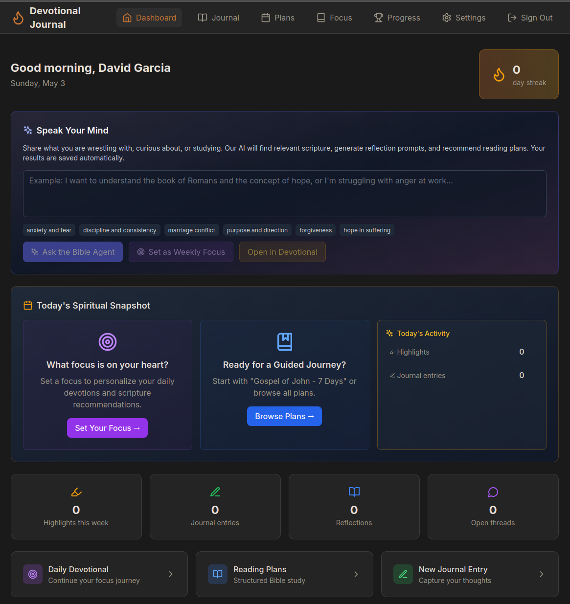
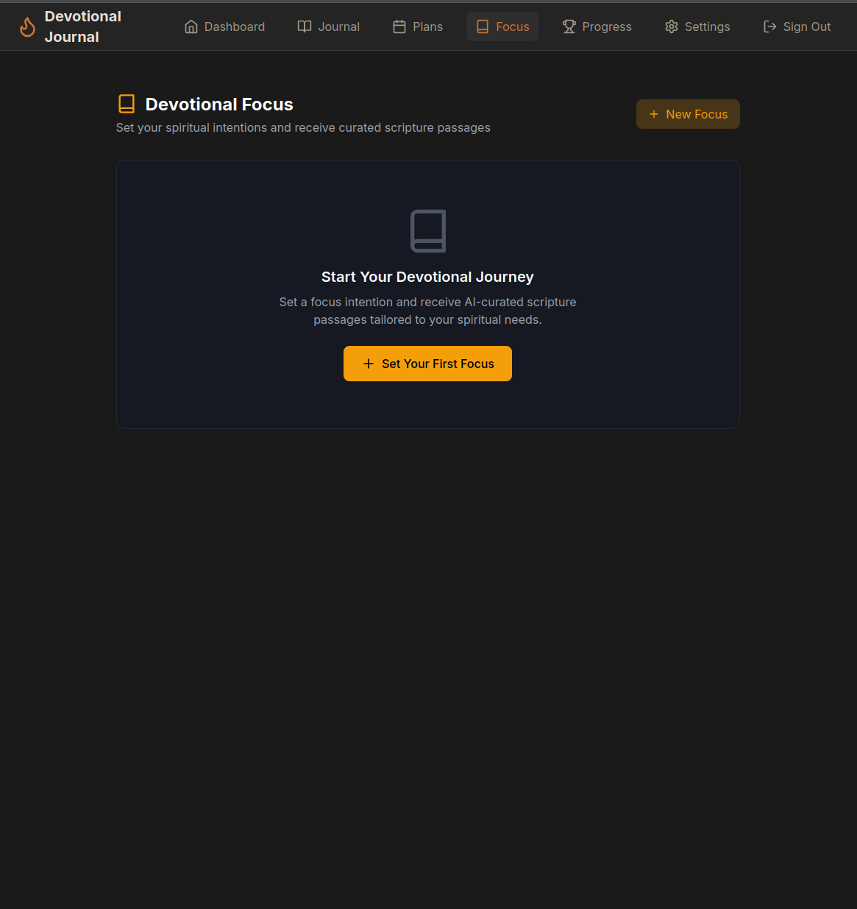
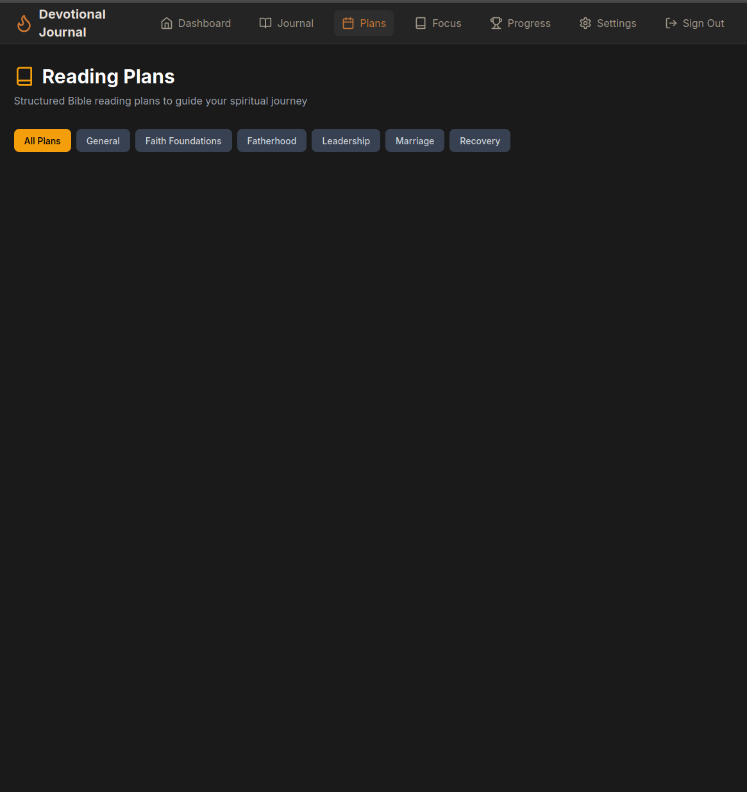
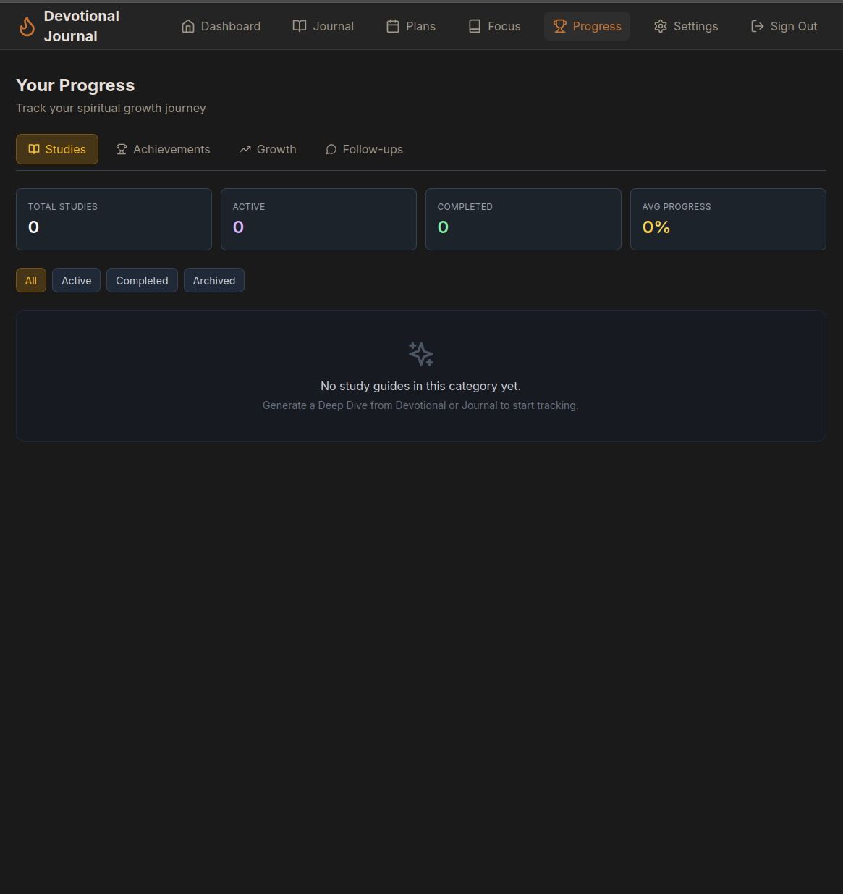

# Devotional Journal

A bilingual (English/Spanish) men's devotional Bible journal — AI-powered scripture study, encrypted journaling, and spiritual growth tracking.



## Features

- **AI-Curated Devotionals** — Set a spiritual focus and receive daily scripture passages, reflection prompts, and study guides
- **Reading Plans** — Browse pre-built plans or generate custom ones with AI
- **Private Journaling** — Encrypted at rest; your entries are unreadable even to the server
- **Daily Reflections** — Life area scoring, gratitude, and end-of-day check-ins
- **Bible Reader** — Built-in KJV reader with highlights, notes, and multi-translation support via Bolls API
- **Progress Tracking** — Streaks, milestones, growth charts, and AI-detected follow-up threads
- **Data Export** — Full JSON backup (GDPR), Markdown exports for journal, highlights, and growth reports
- **Share Cards** — Generate shareable PNG images for streak milestones and achievements
- **Bilingual** — English/Spanish with code-switching support

## Tech Stack

| Layer | Technology |
|-------|-----------|
| Backend | Django 5 + Django REST Framework |
| Frontend | React 18 + TypeScript, TanStack Query, Tailwind CSS |
| Database | PostgreSQL 16 |
| Cache/Broker | Redis 7 |
| Task Queue | Celery + Celery Beat |
| AI | Ollama (local) or Anthropic Claude / OpenAI / OpenRouter |
| Deploy | Docker Compose on Ubuntu VPS, Nginx reverse proxy |

## Quick Start

### Prerequisites

- Docker & Docker Compose
- Python 3.12+
- Node.js 20+

### Development Setup

```bash
git clone https://github.com/curlyphries/devotional-journal.git
cd devotional-journal

# Copy env files
cp .env.example .env
cp backend/.env.example backend/.env
cp frontend/.env.example frontend/.env

# Option A: Docker Compose (everything)
docker compose up -d

# Option B: Run locally
# Backend
cd backend
python -m venv venv && source venv/bin/activate
pip install -r requirements/dev.txt
python manage.py migrate
python manage.py seed_life_areas     # one-time setup
python manage.py runserver

# Frontend (new terminal)
cd frontend
npm install
npm run dev
```

### Key Environment Variables

See `.env.example` for full list. The critical ones:

```env
DATABASE_URL=postgres://devotional:devotional_dev@db:5432/devotional
REDIS_URL=redis://redis:6379/0
ENCRYPTION_ROOT_KEY=<generate: python3 -c "import secrets; print(secrets.token_hex(32))">
LLM_BACKEND=ollama
OLLAMA_BASE_URL=http://localhost:11434
OLLAMA_MODEL=llama3.1:8b
```

## Project Structure

```
devotional-journal/
├── backend/                # Django API server
│   ├── apps/
│   │   ├── bible/          # Bible reader, search, highlights
│   │   ├── groups/         # Group accountability (Phase 2)
│   │   ├── journal/        # Encrypted journal entries
│   │   ├── plans/          # Reading plans, enrollment, AI generation
│   │   ├── prompts/        # AI prompt generation, exploration history
│   │   ├── reflections/    # Focus, reflections, threads, milestones, crew
│   │   ├── streaks/        # Streak tracking model
│   │   └── users/          # Auth, profile, data export
│   ├── config/             # Django settings, URLs, Celery
│   ├── scripts/            # Data loading (KJV, seed plans)
│   └── shared/             # Encryption, pagination, permissions
├── frontend/               # React SPA
│   └── src/
│       ├── api/            # API client modules
│       ├── components/     # Reusable UI components
│       ├── context/        # Auth context
│       ├── hooks/          # React Query hooks
│       ├── i18n/           # English/Spanish translations
│       └── pages/          # Route-level page components
├── docs/                   # Documentation & screenshots
├── docker-compose.yml      # Dev environment
└── docker-compose.prod.yml # Production environment
```

## Documentation

- [Developer Handoff](docs/developer-handoff.md) — Architecture, full API reference, priorities, and tech debt
- [Deployment Guide](docs/DEPLOYMENT.md) — Production server setup, Docker, Nginx, troubleshooting
- [Plan Builder Handoff](docs/plan-builder-handoff.md) — Reading plan data model and builder details

## Contributing

See [CONTRIBUTING.md](CONTRIBUTING.md) for guidelines.

## License

AGPL-3.0 — see [LICENSE](LICENSE).

## Screenshots

| Dashboard | Focus | Plans | Progress |
|-----------|-------|-------|----------|
|  |  |  |  |
